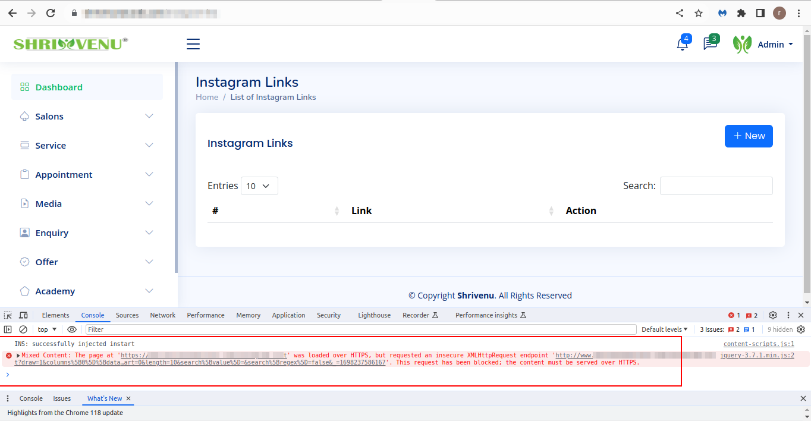

## This request has been blocked; the content must be served over HTTPS. #458

I got some problem when I deploy my project in HTTPS server. I got this error message: This request has been blocked; the content must be served over HTTPS.


### Solution 1:
Go to path **App\Providers\AppServiceProvider** and add this code in the top of your file:
```
 /**
* Bootstrap any application services.
*/
public function boot(): void
{

    if (str_contains(\Config::get('app.url'), 'https://')) {
        \URL::forceScheme('https');
    }
}
```

### Solution 2:
Go to your .htaccess file and add this code in the top of your file:
```
RewriteEngine On
RewriteCond %{HTTPS} off
RewriteRule ^(.*)$ https://%{HTTP_HOST}%{REQUEST_URI} [L,R=301]
```

### Solution 3:
Go to path **App\Providers\AppServiceProvider** and add this code in the top of your file:
```
use Illuminate\Support\Facades\URL;
```
and add this code in boot function:
```
URL::forceScheme('https');
```


