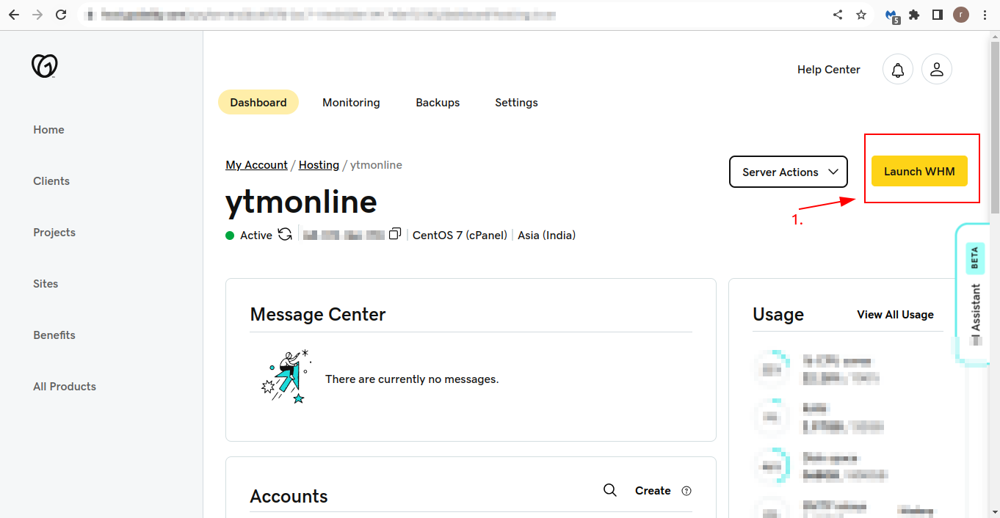
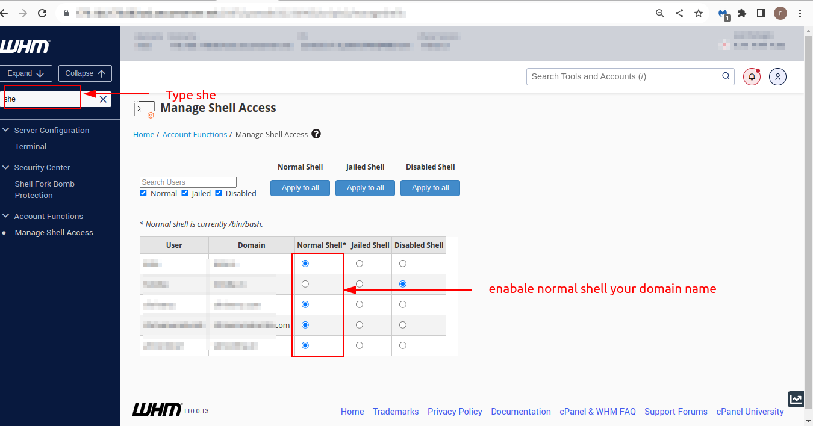
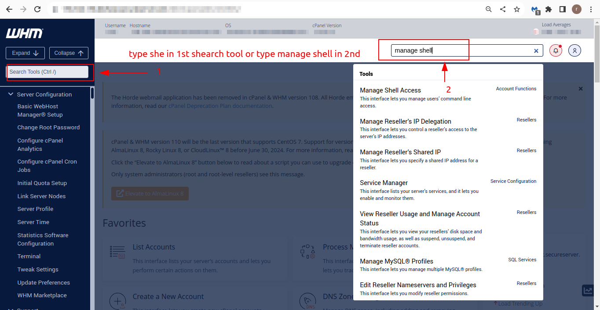

### Add terminal on your cpanel
1. Login to WHM
2. Navigate to the “Account Functions”
3. Type "she" on the 1st search bar on left side of the page or Type "Manage Shell Access" on the 2nd search bar on right side of the page
3. Click on the option “Manage Shell Access”
4. In the next page, you can see the list of accounts and the shell access status of each account.
5. You can enable the same by modifying the account and select the option shell access. You can also enable the same for all the accounts by selecting the option “Enable for all accounts”.

#### Stpes images:

