# How to deploye git private repository to cpanel

## Step 1: Create a new ssh key

Before you can access your private GitHub repository from your GoDaddy hosting environment, you need to set up SSH keys.

a. Generate an SSH key pair on your cPanel using terminal:

    ssh-keygen -t rsa -b 4096

b. Press Enter to accept the default location and file name. Enter and re-enter a passphrase when prompted. The passphrase is optional, but recommended.

c. Go to the ssh access page in cpanel and click on manage ssh keys.

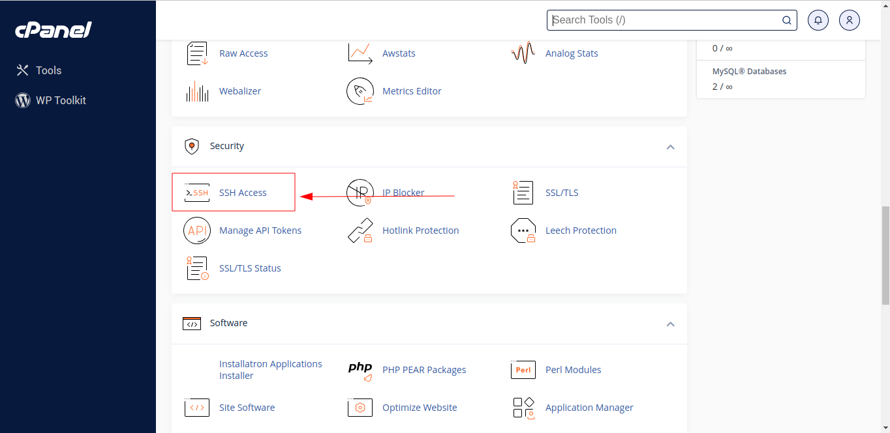

e. Click on manage the keys button then click on authorize.
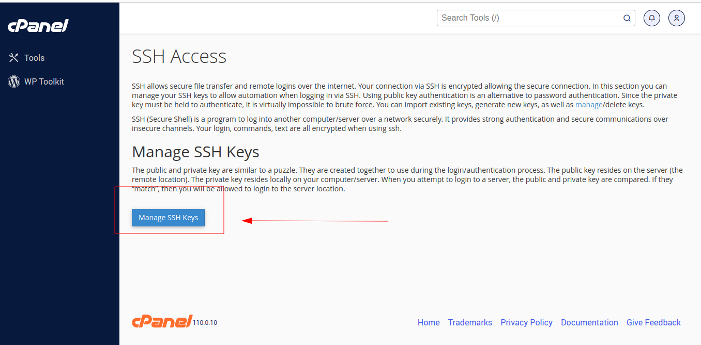
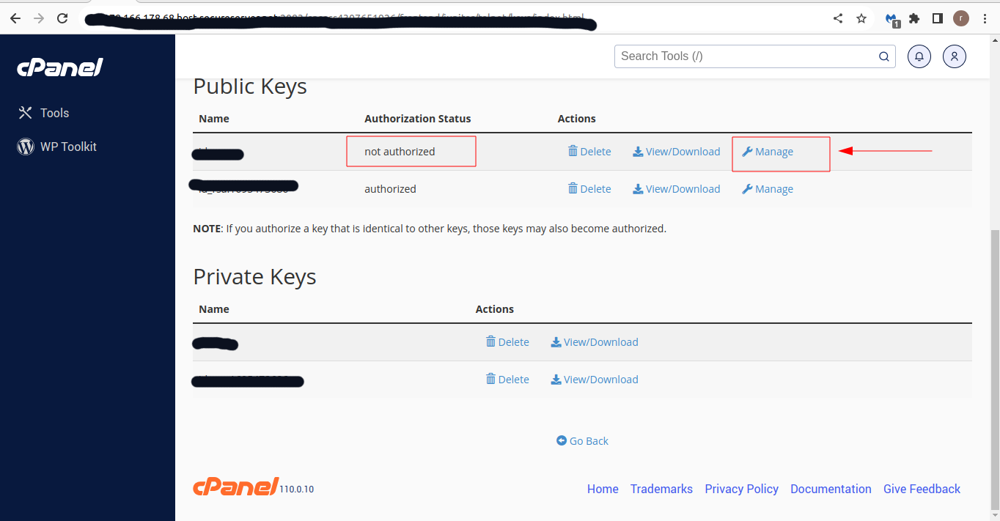
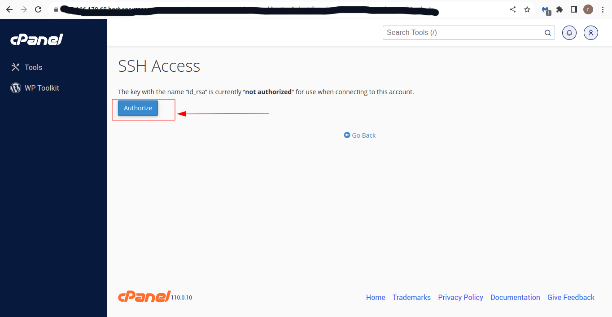

f. make sure that the key is authorized and click view/download button.

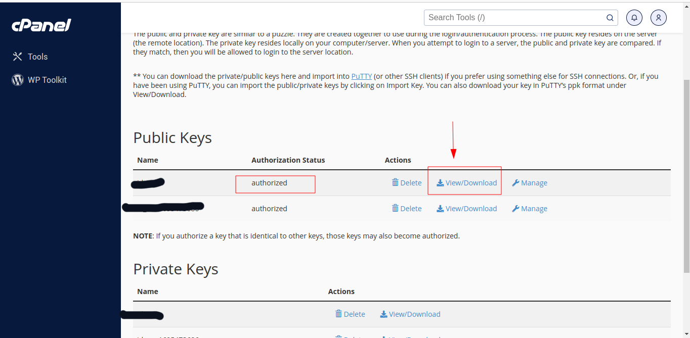

g. copy the key and paste it in your github account.

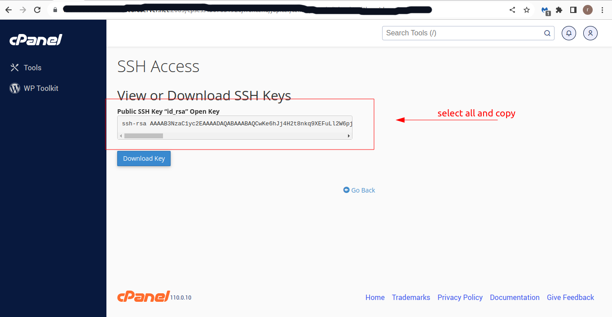

h. Add the public key to your GitHub account:

Go to GitHub > Settings > SSH and GPG keys.
Click on "New SSH key" and paste the content of your ~/.ssh/id_rsa.pub file.

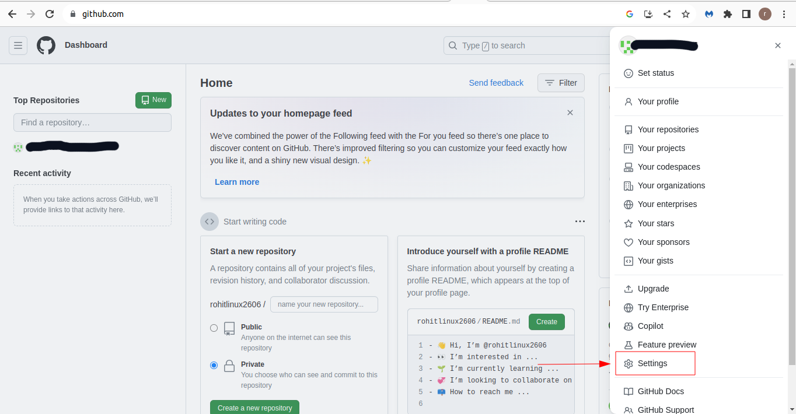
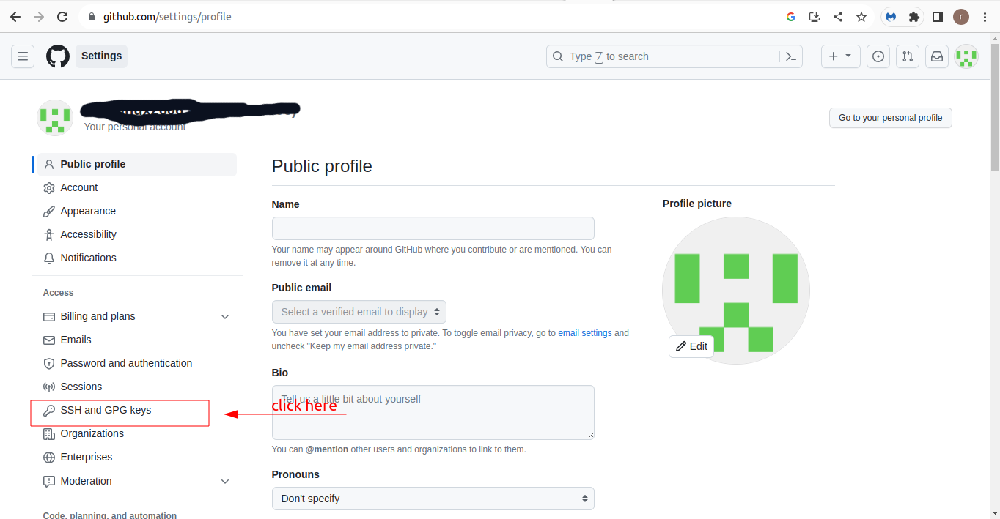
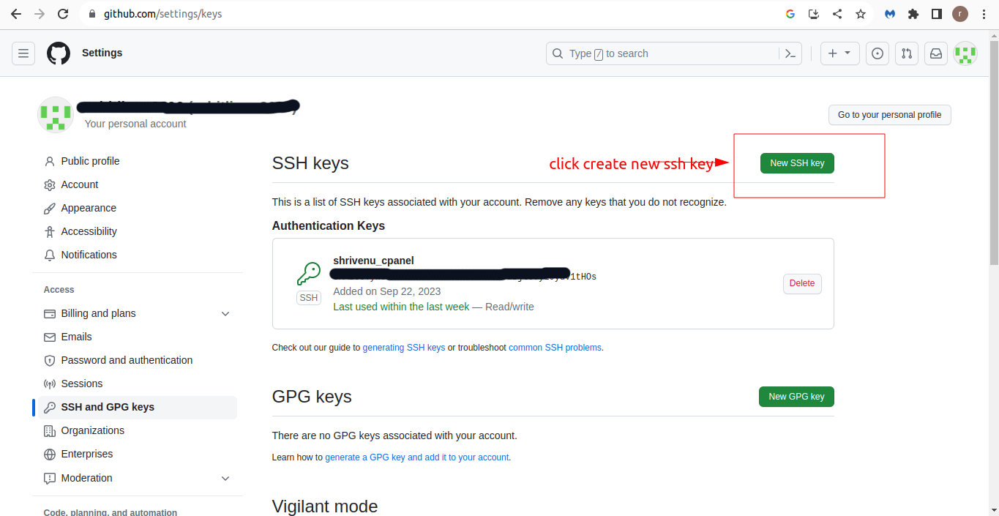
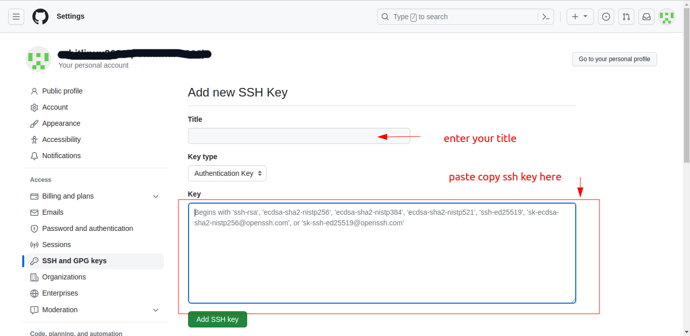

i. Now you go to your cpanel and click on git version control.

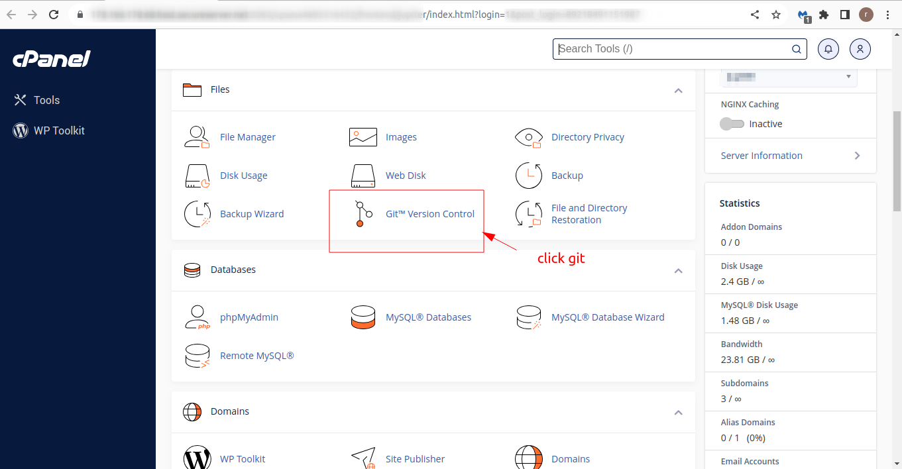

j. Click on create button and fill the form.

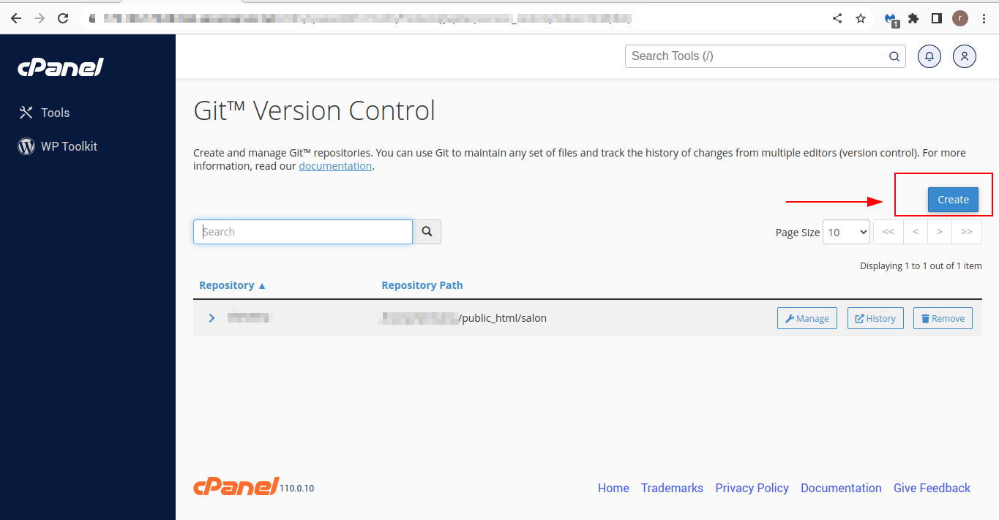

k. Now you can see your repository in the list and copy the ssh url.
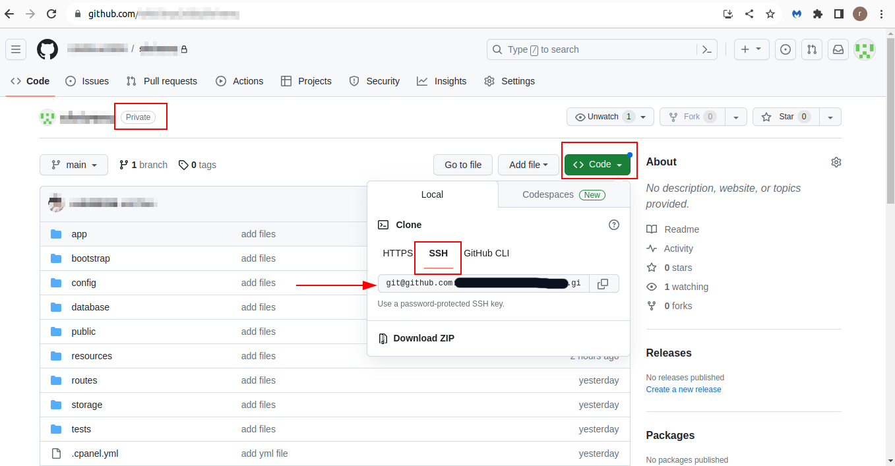

## Step 2: Cone and deploy your project

a. paste the ssh url in cole url input and set deploy path and click on create button.

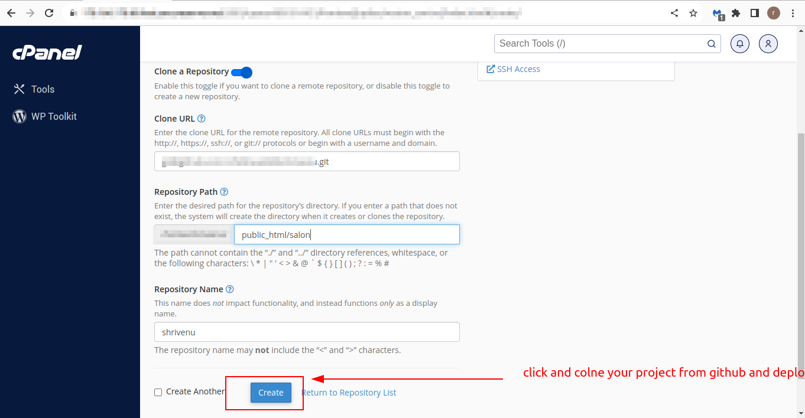

b. Now you can see your repository in the list and click on manage button.

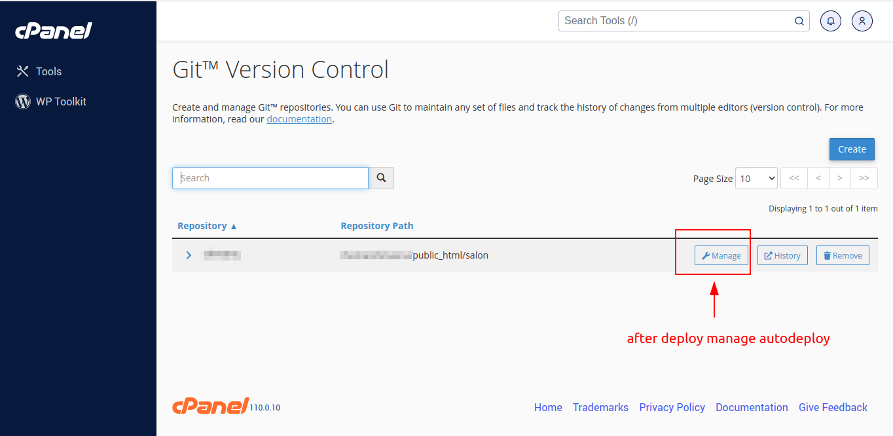

c. Click on update from remote button.

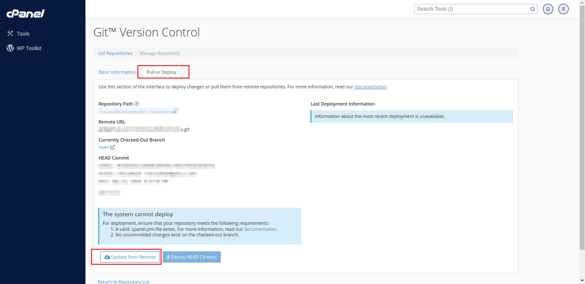

d. Now you can see your project files in the path that you set in step 2.

e. Now goto your domain link and see your project or website.

## Step 3: Set up automatic deployment (Optional)

For continuous deployment, you can set up webhooks or use deployment scripts to automatically pull changes from GitHub whenever there's a push to your repository. This is especially useful for keeping your production environment up to date.

## Step 4: Testing

Access your subdomain in a web browser to ensure your project is functioning as expected.

## If you deploy laravel project you should do this steps:

a. Go to your project directory and copy .env.example file and rename it to .env

b. Open .env file and set your database information.

c. Open terminal and go to your project directory and run this command:

    php artisan key:generate

d. Now you can see your project in your domain link.

e. if you have any problem with your project you can run this command in your project directory:

    php artisan config:cache

f. if not work you can run this command:

    php artisan config:clear

g. after that you can see your project in your domain link.

h. if not show your project on your domain link you can run follow stepts:

1. go to your project directory and open bootstrap/cache/config.php file and delete all content of this file.
2. run this command in your project directory:

    php artisan config:cache

3. now you can see your project in your domain link.

i. if you have any problem with your project you can run this command in your project directory:

    php artisan route:cache
    php artisan route:clear

j. after that you can see your project and routes in your domain link. if not work you can run follow stepts:

1. go to your cpanel and click on domain section.
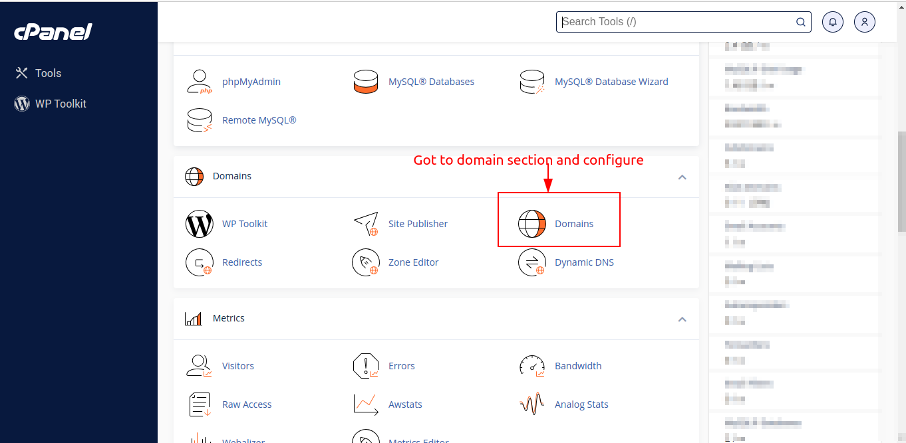

2. then click on manage button.
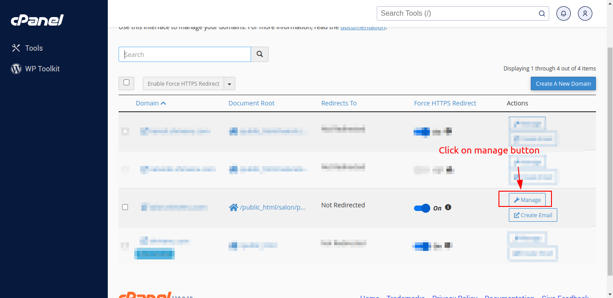

3. configure your project path add /public and click on update button.
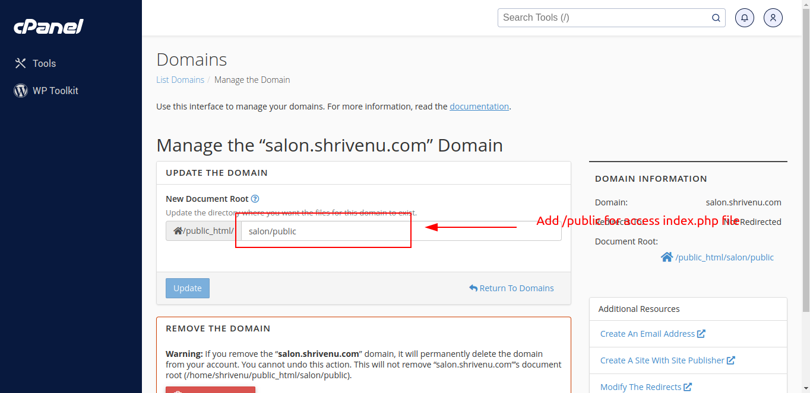

4. now you can see your project in your domain link.    

## If you have any problem or question please contact me.