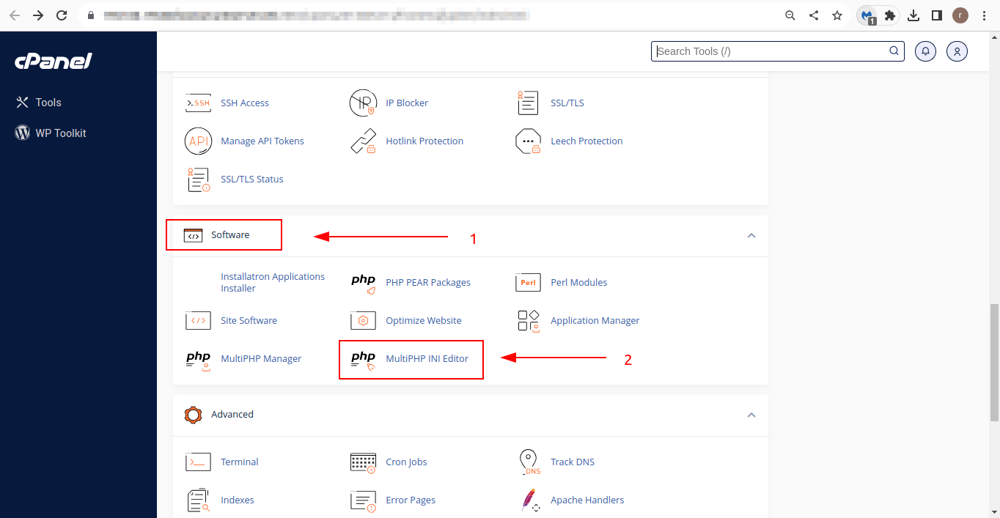
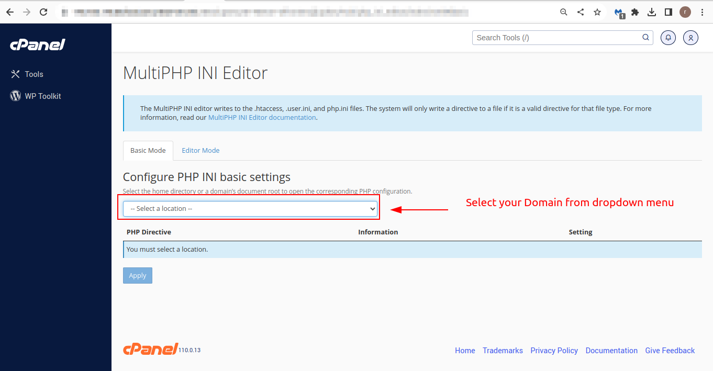
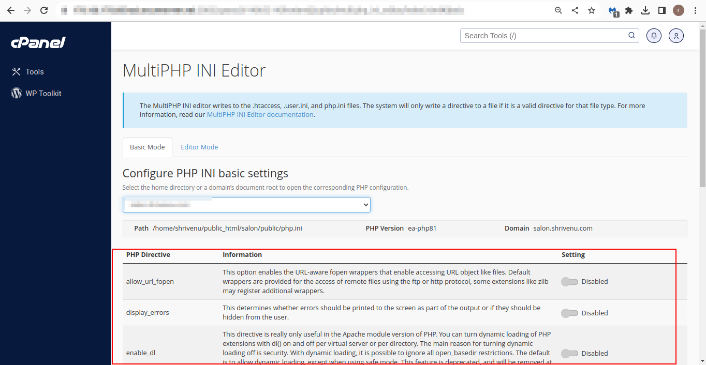
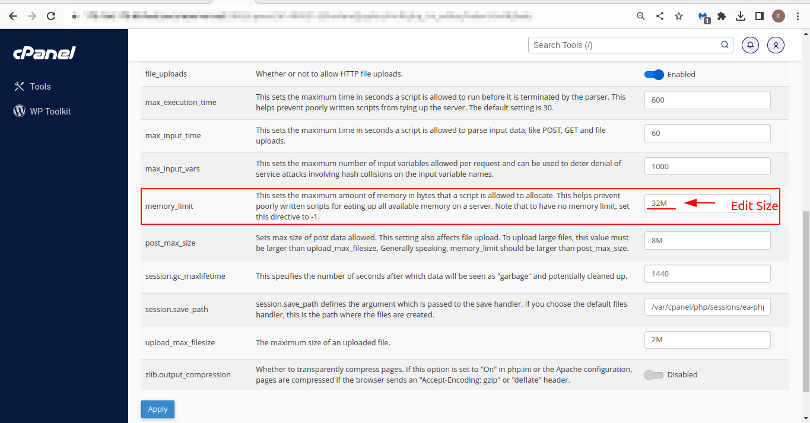

### How to solve the error of "memory exhausted" in Godady server -
1. Step 1: Get Your Cpanel or Login to your Godady account
2. Step 2: Go to the "Software" section and find the PHPini Editor and click on it.
3. Step 3: In the PHPini Editor, locate the section where you can change the memory_limit. Means select your domain name from the dropdown and change/edit the memory_limit to 128M or 256M depends your system.
4. Step 4: Save your changes using Apply button.

#### Stpes images:

