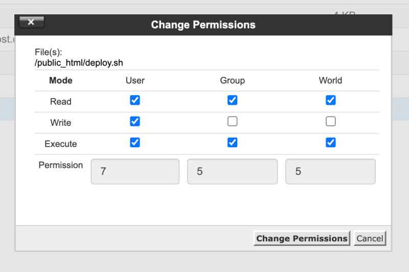

Certainly! Below is an example of a basic deployment script that you can use to automate Laravel project deployment on cPanel using GitHub. This script assumes you have SSH access to your cPanel server.

**1. Create a Deployment Script:**

Create a bash script, for example, `deploy.sh`, on your cPanel server:

```bash
#!/bin/bash

# Change to your Laravel project directory
cd /path/to/your/laravel/project

# Fetch the latest changes from GitHub
git pull origin master

# Install Composer dependencies
composer install --no-interaction --prefer-dist --optimize-autoloader

# Run database migrations and seed (if needed)
php artisan migrate --force

# Clear cache and optimize
php artisan optimize

# Restart the web server (if needed)
# systemctl restart apache2 (for Apache)
# systemctl restart nginx (for Nginx)

echo "Deployment completed successfully."
```

Make the script executable:

```bash
chmod +x deploy.sh
```

We can manually change the bash script file permission using CPanel file permission dialog.



**2. Set Up Webhook in cPanel:**

- In your cPanel, go to "Git Version Control" and set up the deployment configuration.
- Find the deployment URL provided by cPanel.

**3. Create a GitHub Webhook:**

- Go to your GitHub repository.
- Navigate to "Settings" > "Webhooks" > "Add webhook."
- Set the Payload URL to the deployment URL provided by cPanel.
- Optionally, add a secret for enhanced security.

**4. Configure cPanel Cron Job (Optional):**

If you want to automate periodic deployments, you can set up a cron job to run the deployment script:

```bash
# Example cron job (run every 5 minutes)
*/5 * * * * /path/to/deploy.sh >> /path/to/deploy.log 2>&1
```

Replace `/path/to/deploy.sh` with the actual path to your deployment script.

**Important Notes:**
- Make sure the web server user has the necessary permissions to execute the deployment script and write to Laravel directories.
- Adjust the script based on your specific requirements (e.g., environment variables, additional steps).
- Monitor the deployment logs (`deploy.log` in the example) to identify and fix any issues.
- Ensure that your Laravel environment is correctly configured for production in the `.env` file.

This is a basic example, and you may need to customize it based on your specific deployment requirements and server configuration. Always test thoroughly before deploying to a production environment.