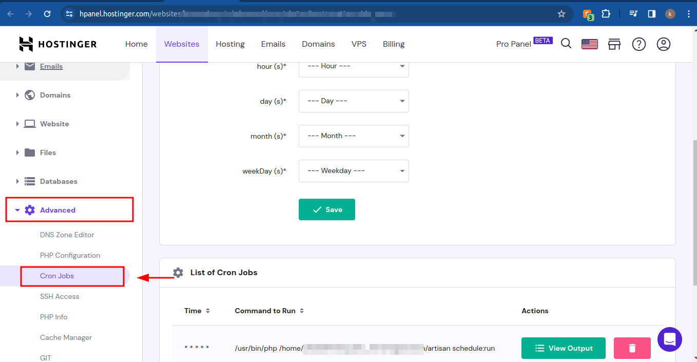
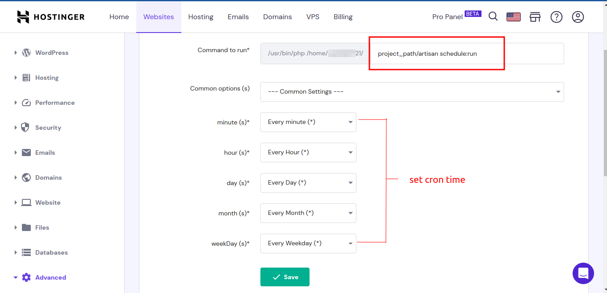
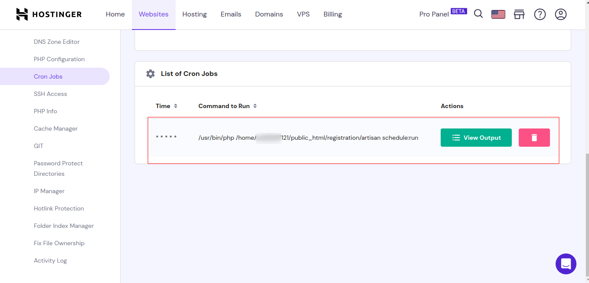

## To set up a cron job on Hostinger using hPanel, follow these steps:

#### Laravel official documentation: [Task Scheduling](https://laravel.com/docs/10.x/scheduling)

1. Log in to your hPanel and navigate to the Cronjobs section.


1. Enter project path and command to run in the corresponding fields. You can also set up the cron job to run at a specific time or date.


for cpanel - cronjob command
```bash
* * * * * cd /path-to-your-project && php artisan schedule:run >> /dev/null 2>&1
```
for hostinger - cronjob command
```bash
/project_path/artisan schedule:run
```

