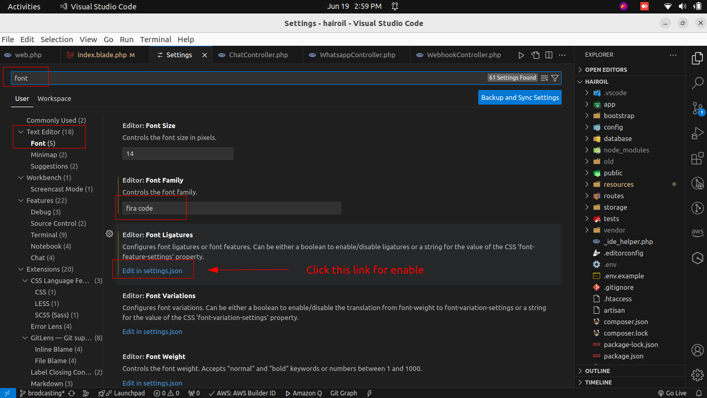
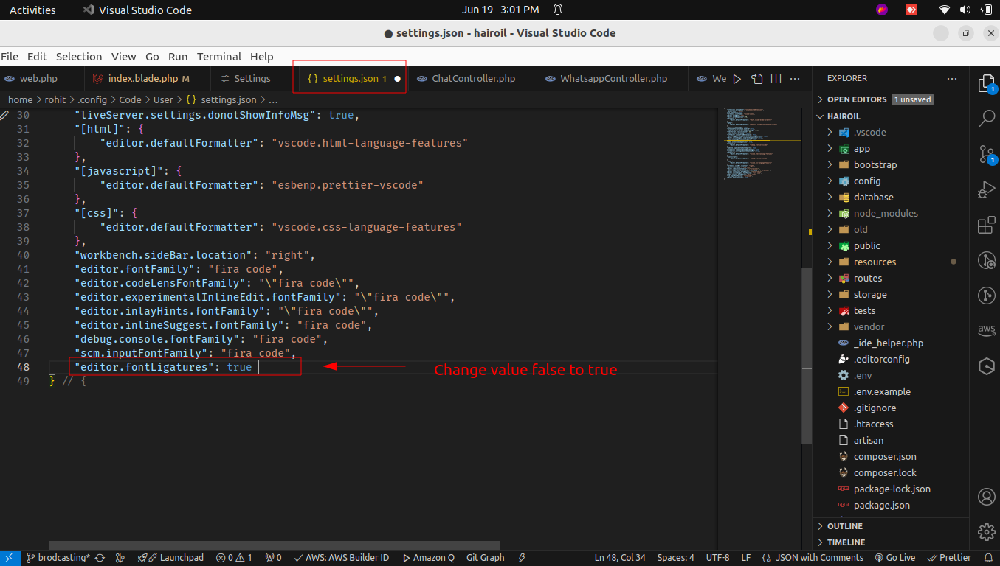

There are two main ways to install Fira Code and set it as your font in VS Code on Ubuntu:

**Method 1: Using the Package Manager**

This is the simplest method:

1. Open a terminal window.
2. Run the following command to install the Fira Code fonts:

```
sudo apt install fonts-firacode
```

3.  Once the installation is complete, open VS Code.

4. Go to **File > Preferences > Settings** (or **Code > Preferences > Settings** on macOS).

5. Search for "font family".

6. In the "Font Family" input box, type "Fira Code" and select it from the list.

7. (Optional) You can also enable font ligatures for a more polished look. Search for "font ligatures" and enable the checkbox.

**Method 2: Downloading the Font Files Manually**

If the package manager method isn't available or you prefer manual installation:

1. Download the Fira Code font files from the official GitHub repository: [https://github.com/tonsky/FiraCode](https://github.com/tonsky/FiraCode)
2. Extract the downloaded archive.
3. Open the folder containing the extracted font files (typically named `ttf`).
4. Right-click on the desired font file (e.g., `FiraCode-Regular.ttf`) and select "Install Font".
5. Update the font cache by opening a terminal and running:

```
fc-cache -f
```

6. Follow steps 4-7 from Method 1 to set Fira Code as your font in VS Code.

After following either method, restart VS Code if necessary for the changes to take effect. You should now be using the Fira Code font in your editor.

7. Downloading the Font Files from github

    1. Download the Fira Code font files from the official GitHub repository: [https://github.com/tonsky/FiraCode](https://github.com/tonsky/FiraCode)

    2. Installing - [https://github.com/tonsky/FiraCode/installation](https://github.com/tonsky/FiraCode/wiki/Linux-instructions#manual-installation)

    3. Setup in Vscode - [https://github.com/tonsky/FiraCode/VS-Code](https://github.com/tonsky/FiraCode/wiki/VS-Code-Instructions)

    4. Follw this steps for enable **ligatures**
         
         